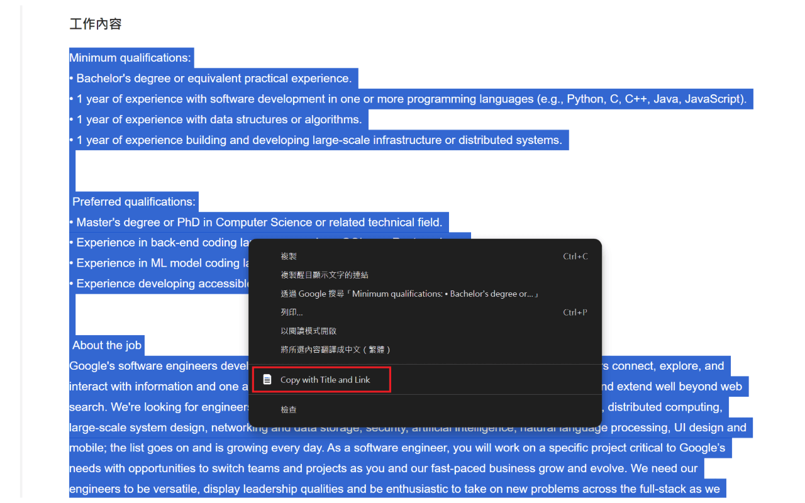

# JD Copier

A Chrome extension that automatically appends page titles and URLs to copied text.

## 📥 Installation & Usage

1.  Install from [Chrome Web Store](https://chromewebstore.google.com/detail/jd-copier/ogfcdcjopjfnoplogmkjcfbokanhocjp).
2.  Select any text on a webpage.
3.  Right-click and choose **"Copy with Title and Link"**.
4.  Paste it anywhere.

## 📸 Screenshots

|                         1. Right-click Menu                         |                          2. Paste Result                          |
| :-----------------------------------------------------------------: | :---------------------------------------------------------------: |
|  |  |

## 🗺️ Roadmap

- [x] v1.0.0 Initial Release
- [ ] Add tests
- [ ] Add Multi-language Support
